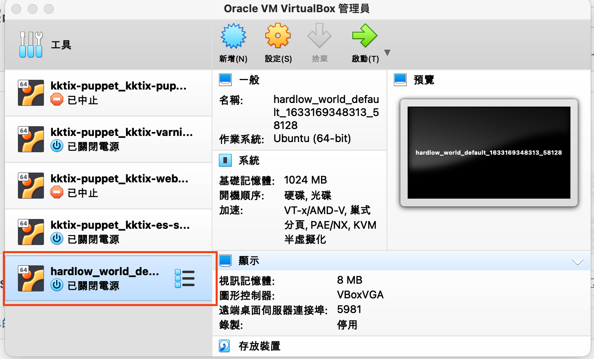
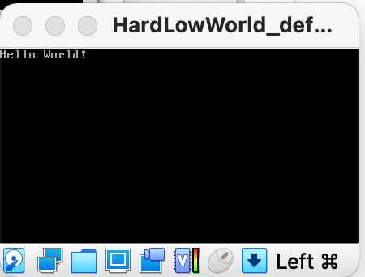

# Use the hard way to write hello world
Using VirtualBox to boot a OS which only prints Hello World.
Actually, it is not OS, but this project shows you how to boot os with grub2 in VirtualBox. LOL

## How to hello world the hard way

1. Run `vagrant up`
2. Double click the machine you just created in VirtualBox UI.

Then you will see nothing but `hello world`. How exciting! 🤣

## Under the hood

After vagrant up, you will see the ubuntu provisioning with `boot.sh`.
These are what `boot.sh` does.
1. Compile the HelloOS program which print "Hello World" but has no dependencies like `stdio.h`.
2. Modify the grub config in `/etc/default/grub`, switch the default booting OS to HelloOS.
3. Set how HelloOS boot in `/boot/grub/grub.cfg`.

## Dependent tools
- Vagrant
- VirtualBox

## Credit
This repository is to show how to start program with grub in VirtualBox.
The HelloOS program itself is from [here](https://gitee.com/lmos/cosmos/tree/master/lesson02/HelloOS).
